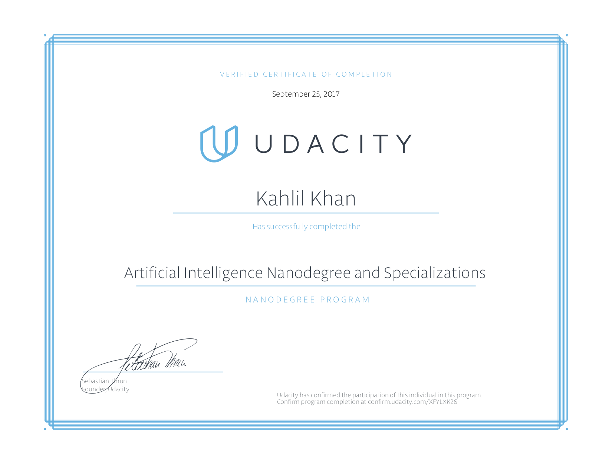

Artificial Intelligence and Specialization Nanodegree
=====================================================

### About

This repository contains project work associated with Udacity's [Artificial Intelligence Nanodegree](https://www.udacity.com/course/nd898) and [Natural Language Processing Nanodegree](https://www.udacity.com/course/nd892).

### Projects

Introduction to Artificial Intelligence
- **p1** - Solve a Sudoku with AI
- **p2** - Build a Game-Playing Agent
- **p3** - Implement a Planning Search
- **p4** - Build a Sign Language Recognizer

Deep Learning and Applications
- **p5** - Dog Breed Classifier
- **p6** - Time Series Prediction and Text Generation

Natural Language Processing
- **p7** - Machine Translation (Capstone Project)
